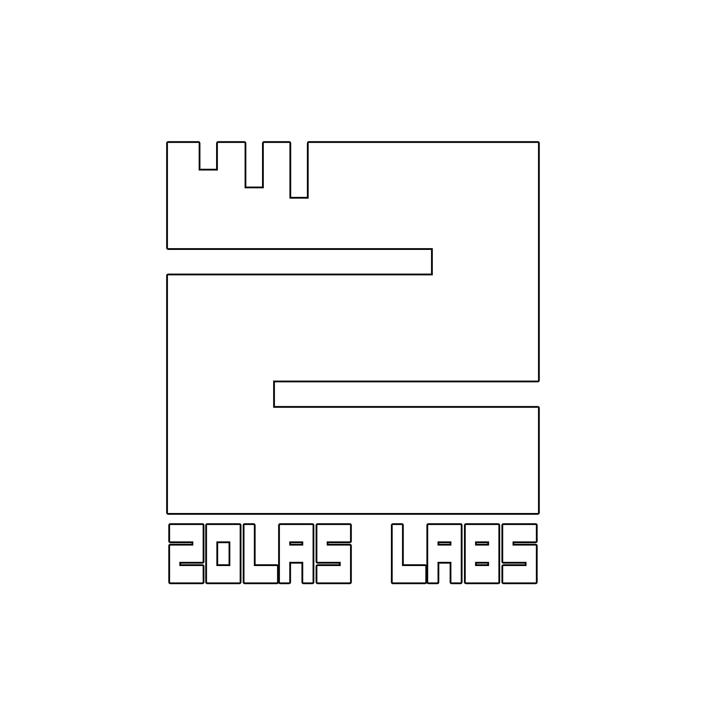

# Zolas labs

> Step into something anew

[Zolas labs](https://exuvia.network) is a team of crypto enthusiasts, talented gamers, and developers dedicated to bringing a portfolio of digital assets, technology, and consulting services to the blockchain and cryptocurrency industries. Using blockchain technology as a foundation, bringing ground-breaking new concepts to the market and improving the gaming world experience. The team is dedicated to developing fun, long-lasting NFT games and DApps by allowing users to own digital assets via NFTs, and providing players, artists, and developers with an ideal place to migrate as well as a place to earn simply by playing, thereby assisting many people through scholarships and charity events on the community. Zolas labs also aims to provide a scalable solution for the Ethereum Network by making a layer-2 scalable solution network which is called Zolas Network based on EVM compatible ZK-rollup that will focus on payments transaction and application data transactions.
